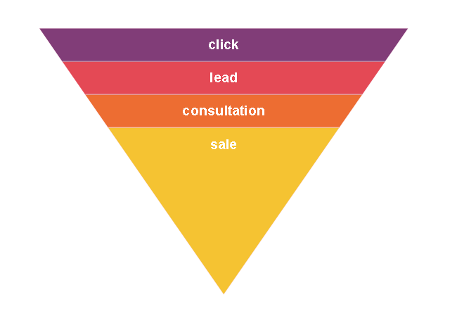
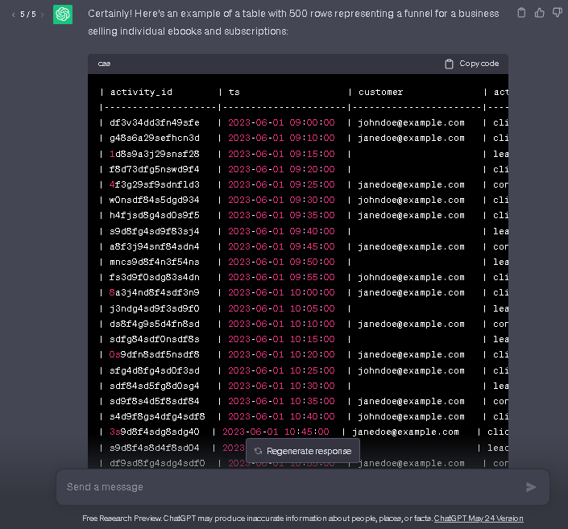
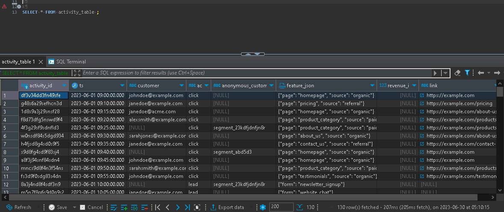

Activity schema based on fictional data
==========================================

This is an example of an activity schema populated with fictional data. See info on [ActivitySchema](https://github.com/ActivitySchema/ActivitySchema/blob/main/README.md) as well as [Documentation](https://github.com/ActivitySchema/ActivitySchema/blob/main/2.0.md).

### List of files:
[Funnel image](Funnel.png)
[Activity table](activity_table_peargrape.csv)
[SQL script](script.sql)

## Conceptual schema of activity

There are 4 types of activities, `click` -> `lead` -> `consultation` -> `sale`. A customer clicks links one or several times (links they have clicked are displayed in `link` column), then it can be followed by a `lead` with filling a form (displayed in `feature_json` column), then a `consultation` comes (`feature_json` displays preferred time), and, finally, it can end up with a sale. In this case, there is a description in `feature_json` column, e.g. 
```json
{
  "product": "ebook", "price": 19.99
}
```
<br>


## Table creation
Now, we need to create a table based on the [example](https://github.com/ActivitySchema/ActivitySchema/blob/main/2.0.md#activity-stream)

**Column**|**Description**|**Type**|**Required**
-----|-----|-----|-----
activity\_id|Unique identifier for the activity record|string|yes
ts|Timestamp for when the activity occurred|timestamp|yes
customer|Email as a unique identifier for the customer|string|yes
activity|Name of the activity based on funnel (`click`, `lead`, `consultation`, `sale`)|string|yes
anonymous_customer\_id|A unique customer id for cases when `customer` value is null|string|no
feature\_json|Activity-specific features|JSON|yes
revenue\_impact|Revenue or cost associated with the activity. Not null only when activity value is `sale`|float|no
link|URL of a link. . Not null only when activity value is `click` |string|no
<br>

We are going to do the following steps:
1. [Create an empty table `activity_table` in SQL](#-1-create-empty-table)
2. [Generate data for the table using ChatGPT](#-2-generate-data)
3. [Copy data into MS Excel, preprocess it and save in a .csv file](#-3-copy-data-into-excel)
4. [Populate table we created in step 1 with data from .csv file](#-4-populate-table)
<br>

## Create an empty table
To do this, we create an empty table:
```sql
CREATE TABLE activity_table (
  activity_id varchar(50) PRIMARY KEY,
  ts timestamp,
  customer varchar(200),
  activity varchar(50),
  anonymous_customer_id varchar(200),
  feature_json json,
  revenue_impact decimal(5,2),
  link varchar(200)
);
```
<br>

The SQL script (with other queries) is available via [link](script.sql)

<br>

## Generate data for the table using ChatGPT
<br>

 request for ChatGPT")
<br>

Then, we need data for our table. ChatGPT is a very powerful and helpful tool but still needs 'help' from a human.
To tell the truth, this was the hardest part. ChatGPT can generate tables and do a lot of funny and useful stuff but if it forgets something, it is much easier to start the process from the beginning than to explain what exactly should be improved.
Initially, I was going to generate about 500 rows.

<br>


<br>

After some attempts and discussions with a polite but not very clever (and sometimes almost stupid and useless) AI, I had to suppress my hunger for data down to 130 rows. 
That was not the end of pain and suffering which we will see in the next step.

<br>

## Copy data into MS Excel, preprocess it and save in a .csv file

Data from the table was copied and preprocessed, redundant spaces deleted. It turned out that 'unique' values of `activity_id` turned out to be non-unique (thank to ChatGPT) were replaced.
Moreover, logic of a funnel (`click` -> `lead` -> `consultation` -> `sale`) was not always present correctly (for example, there were customers with only `lead` activities). There were also customers with both non-null `customer` and `anonymous_customer_id` as well as rows where both columns were null. This all was corrected manually.
All in all, we have a [table](activity_table_peargrape.csv)!

## Populate table we created in step 1 with data from .csv file
This was the easiest part using **psql**. 
Some time spent, and here we go!

<br>



<br>

Done! Now we can query our model. There are some simple queries in [script.sql](script.sql) file

<br>

**Thank you for your patience!**

<br>


I am available via email karavaevms(at)gmail(dot)com, Telegram @karavaevms, [LinkedIn](https://www.linkedin.com/in/mikhail-karavaev/)