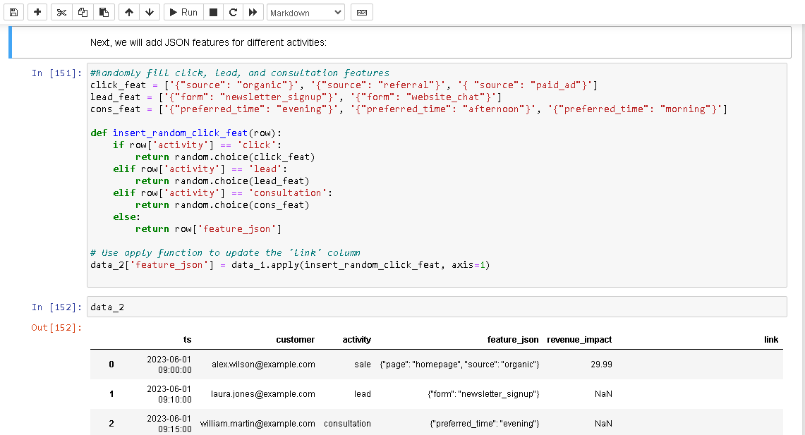

Activity schema based on fictional data 
==========================================
## *version 2* 
Start with [version 1](v_1.md) then return ;)  

Welcome back!  

**Here, we create a large [activity table](v_2/table_2k.csv) with dummy data and write a [query](v_2/v_2_Script.sql) to calculate conversion**


**SPOILER:  

The final [query](v_2/v_2_Script.sql):  

```sql

SELECT customer, link, COUNT(*) AS sequence_count
FROM (
    SELECT customer, link, activity,
           LEAD(activity, 1) OVER (PARTITION BY customer 
           ORDER BY customer, ts) AS next_activity_1,
           LEAD(activity, 2) OVER (PARTITION BY customer 
           ORDER BY customer, ts) AS next_activity_2,
           LEAD(activity, 3) OVER (PARTITION BY customer 
           ORDER BY customer, ts) AS next_activity_3
    FROM table_activity ta  
) subquery
WHERE activity = 'click'
  AND next_activity_1 = 'lead'
  AND next_activity_2 = 'consultation'
  AND next_activity_3 = 'sale'
GROUP BY 1, 2;
```

  


### Version 2 updates:
- New [activity schema](v_2/table_2k.csv) (2K+ rows) with dummy data 
- [Test dataset](v_2/test_dataset.csv) (30 rows, for testing queries)  
- [SQL script](v_2/v_2_Script.sql) for calculating conversion 
- [Jupyter notebook](v_2/activity_schema_script.ipynb) for creating new activity schema 


### Here is the plan:  

1. Augment dummy data from the [first table](activity_table_peargrape.csv) using Jupyter (see [notebook](v_2/activity_schema_script.ipynb))  
2. Open the table in DBeaver (using PostgreSQL) and write a [query](v_2/v_2_Script.sql)  

## 1. Augment dummy data and create a large table  

See the illustrated history below or just open the [notebook](v_2/activity_schema_script.ipynb)  

  

  

  

  

 

 

  

  


The [large activity table](v_2/table_2k.csv) is created!  


## 2. Create a query  

Now, we are about to create a query.  

I remind that only a strict sequence `click`&rarr; `lead` &rarr; `consultation` &rarr; `sale` should be considered, i.e., when there is a `click` &rarr; `consultation` or a `sale` &rarr; `sale` &rarr; `consultation` &rarr; `sale` situation, they must be ignored.

To check the query, I created a [test table](v_2/test_dataset.csv) of 30 rows based on our large table.  

  

Look at the picture above. There are 3 **real** matches (the same user has gone through all the funnel), highlighted in **yellow**, and a **false** one (**red**). In the picture (I am not good at drawing, sorry) you can see that the fals match is in fact a "right" sequence of activities but it belongs to different customers. Wrong code can count it as another match.  

I asked my good old friend to help me, and he (or she) gladly did.  

  

Unfortunately, this code was lame. Window function cannot be used in WHERE.   

I told Chat GPT about it (in Russian!), and it created working code:  

  

```sql
SELECT customer, link, COUNT(*) AS sequence_count
FROM (
    SELECT customer, link, activity,
           LEAD(activity, 1) OVER (ORDER BY customer, ts) AS next_activity_1,
           LEAD(activity, 2) OVER (ORDER BY customer, ts) AS next_activity_2,
           LEAD(activity, 3) OVER (ORDER BY customer, ts) AS next_activity_3
    FROM test_dataset td  
) subquery
WHERE activity = 'click'
  AND next_activity_1 = 'lead'
  AND next_activity_2 = 'consultation'
  AND next_activity_3 = 'sale'
GROUP BY 1, 2;
```


Now it's time to check it on my test table!  

  

**4** funnels. Now do you understand why we created the [test table](v_2/test_dataset.csv)?  

We obviously need a partition but let's give our good old friend a second chance!  

  

```sql
SELECT customer, link, COUNT(*) AS sequence_count
FROM (
    SELECT customer, link, activity,
           LEAD(activity, 1) OVER (PARTITION BY customer 
           ORDER BY customer, ts) AS next_activity_1,
           LEAD(activity, 2) OVER (PARTITION BY customer 
           ORDER BY customer, ts) AS next_activity_2,
           LEAD(activity, 3) OVER (PARTITION BY customer 
           ORDER BY customer, ts) AS next_activity_3
    FROM test_dataset td  
) subquery
WHERE activity = 'click'
  AND next_activity_1 = 'lead'
  AND next_activity_2 = 'consultation'
  AND next_activity_3 = 'sale'
GROUP BY 1, 2;
```
See [test dataset query](v_2/test_data_query.sql)  

What's the result?  

  

**3 rows**. Ta-da!  

Now we do the same with our large table.

The final [query](v_2/v_2_Script.sql):  

```sql

SELECT customer, link, COUNT(*) AS sequence_count
FROM (
    SELECT customer, link, activity,
           LEAD(activity, 1) OVER (PARTITION BY customer 
           ORDER BY customer, ts) AS next_activity_1,
           LEAD(activity, 2) OVER (PARTITION BY customer 
           ORDER BY customer, ts) AS next_activity_2,
           LEAD(activity, 3) OVER (PARTITION BY customer 
           ORDER BY customer, ts) AS next_activity_3
    FROM table_activity ta  
) subquery
WHERE activity = 'click'
  AND next_activity_1 = 'lead'
  AND next_activity_2 = 'consultation'
  AND next_activity_3 = 'sale'
GROUP BY 1, 2;
```

  

Read [version 1](v_1.md)

**Thank you for your patience!**  

I am available via email karavaevms(at)gmail(dot)com, Telegram @karavaevms, [LinkedIn](https://www.linkedin.com/in/mikhail-karavaev/)